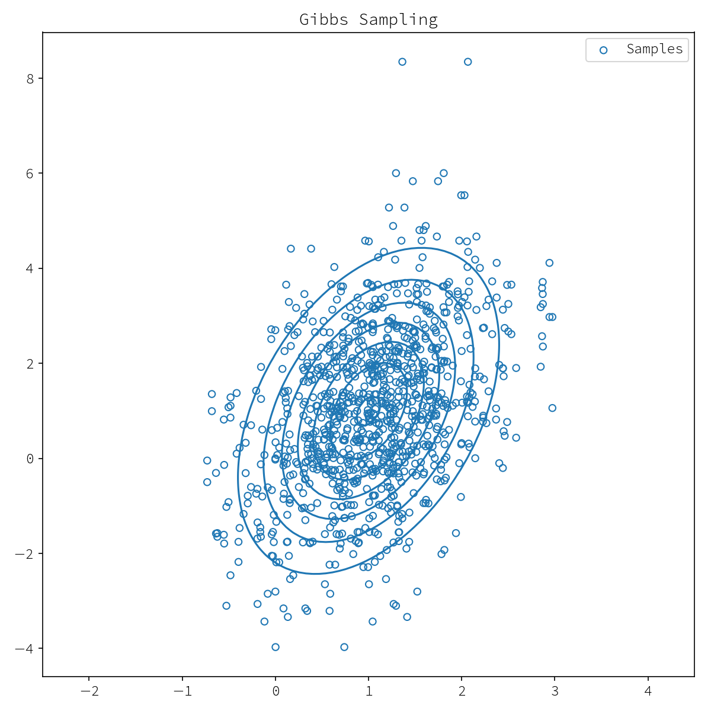
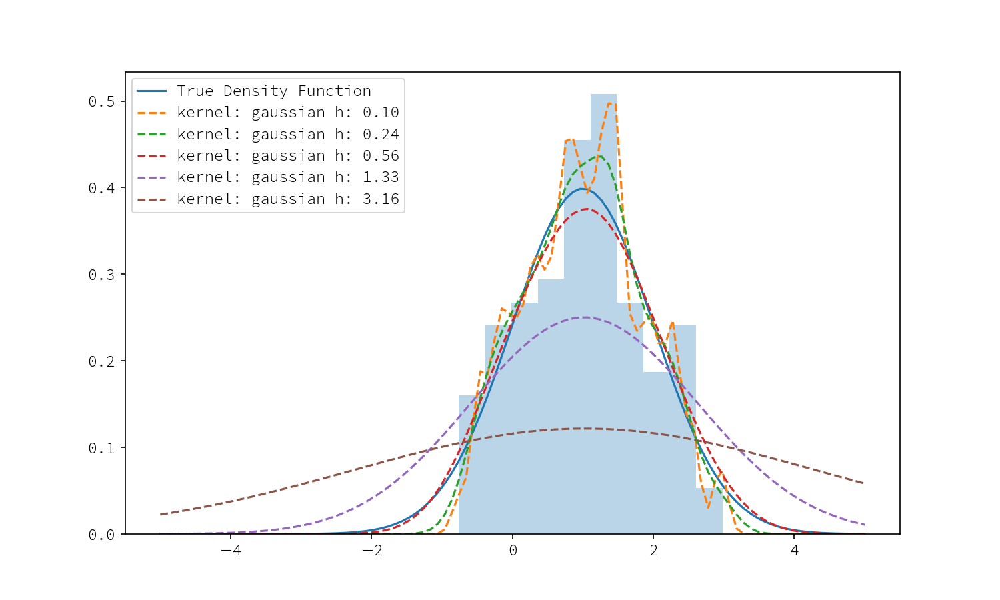
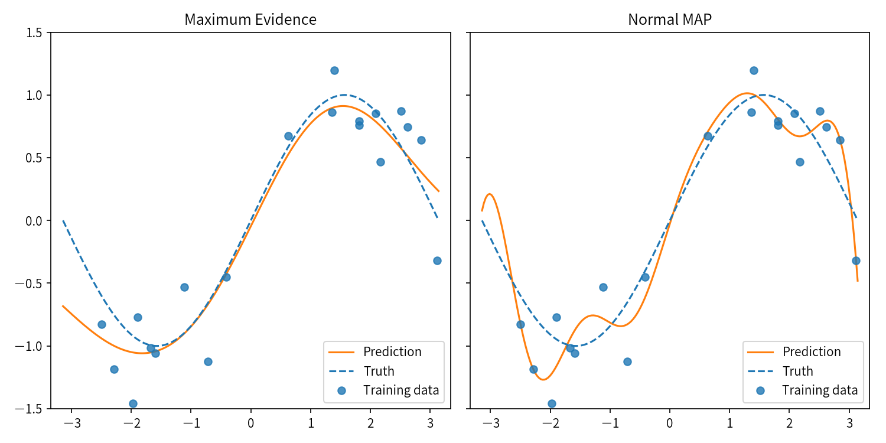
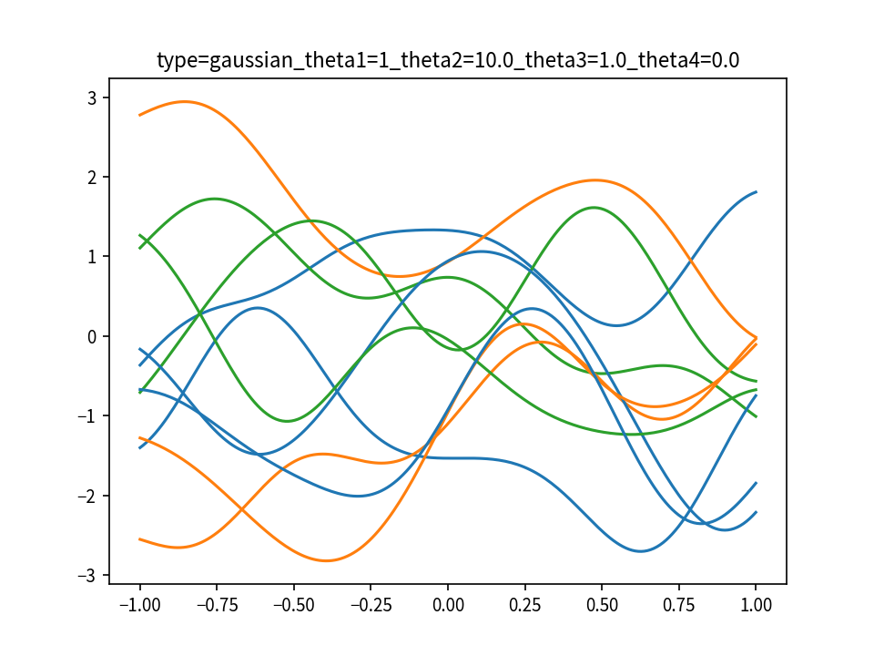
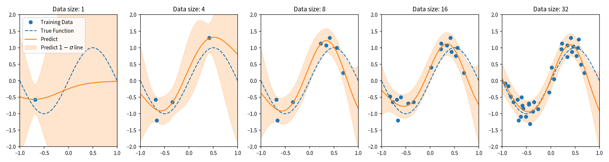
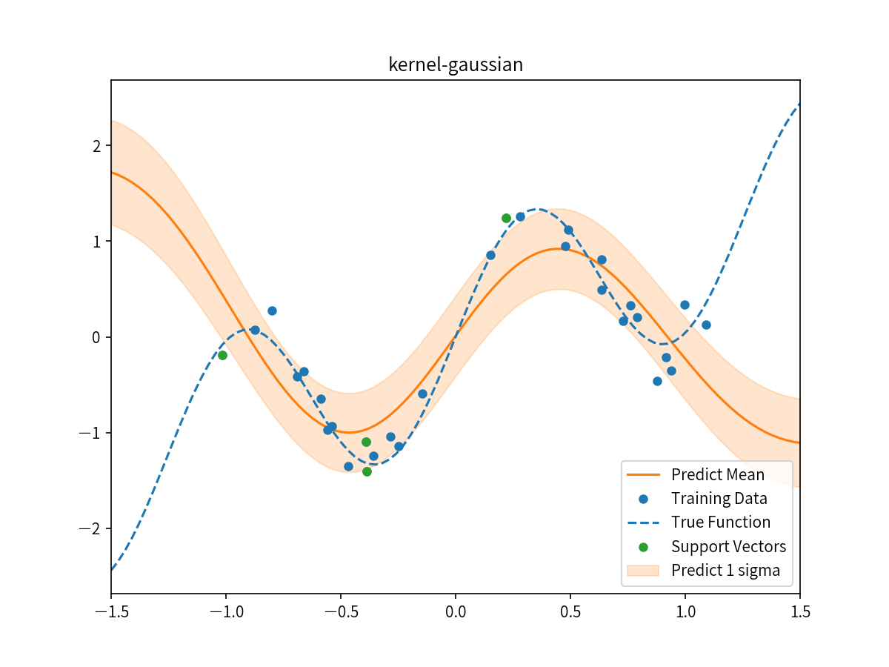
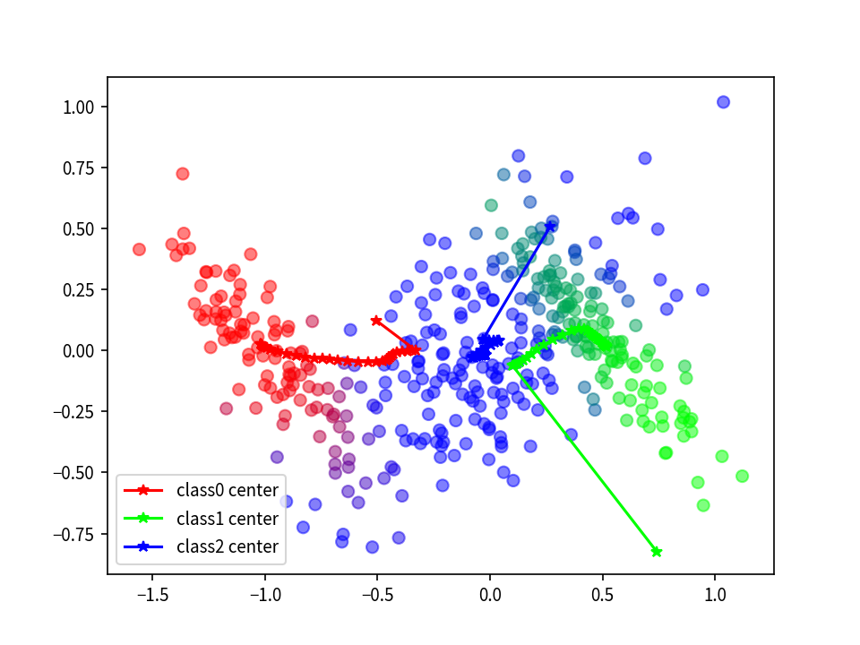
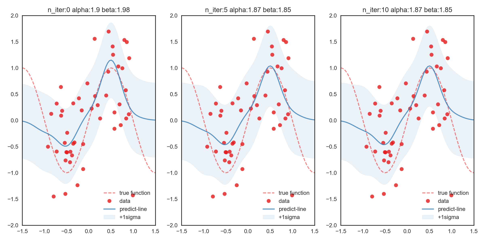

# Machine Learning

機械学習に関する python ファイルをまとめていくリポジトリ.

## 環境

* Python 3.6.0 :: Anaconda 4.3.0 (x86_64)

## requirements

* numpy
* scipy
* scikit-learn
* matplotlib

## Contents

### サンプリング

#### [gibbs sampling による多次元ガウス分布のサンプリング](gibbs_sampling.py)

二次元ガウス分布に対するギブスサンプリング

### PRML

#### [カーネル密度推定](./prml/density_estimation.py)

一次元データ(図中でヒストグラムで表現されている)に対してカーネル幅の異なるカーネルを用いたときの密度推定の可視化

#### [線形回帰モデルに対するエビデンス最大化](./prml/linear_regression.py)
エビデンス最大化を用いた、線形回帰モデルの精度パラメータ及び重みの事前分布を決める係数の最適化。
最適化を行った予測(左図)では、Map推定(右図)したときのように過学習しない様子を可視化しています。

#### [ガウス過程 > 事前分布](./prml/gaussian_process_prior.py)

ガウス過程でデータが得られていないときの重みの事前分布からの確率過程のサンプリング

#### [ガウス過程 > 新しいデータに対する予測](./prml/gaussian_process_estimation.py)
ガウス過程に基づく予測。
データが増えると予測の分散も減っていく様子を可視化しています。

####  [RVM (Relevant Vector Machine)](./prml/rvm.py)
信頼ベクトルマシン(RVM)を用いた予測。
プラスして信頼区間、およびサポートベクトルも表示。

#### [EM Algorithm](./prml/em_algorithm.py)
EMアルゴリズムを用いた教師なし学習。
データは3つの平均と分散の異なる二次元ガウス分布から生成し、それを3つのクラスタに分類。

#### [Variance Inference](./prml/variance_inference.py)

線形回帰モデルに対するエビデンス最大化の発展で、代わりに変分推論を行った結果の可視化。(あまり綺麗に結果に出ていないので今後治したい…)

### その他

* [black sholes 方程式](./black_scholes.py)
